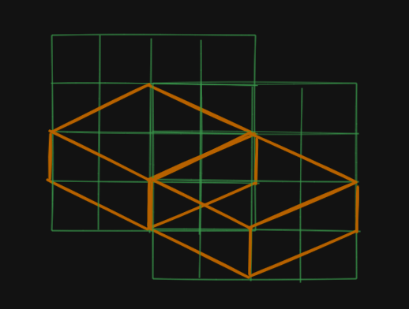

## Isometry

The degree of isometry can be formally defined as a ratio:
                Isometry = Width/ Height

This game uses a classic 2:1 ratio

This means that for a tile to move laterally in the isometric coordinate space, every 1 unit rise has to be accompanied by 2 units of run
